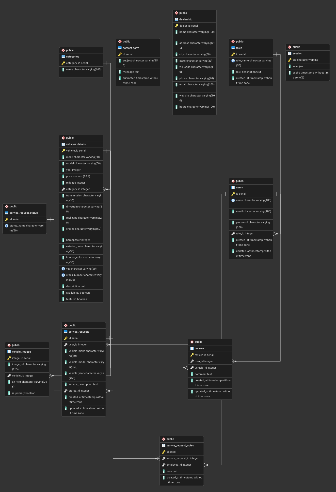

# De la Cruz Auto Sales

## Project Description

De la Cruz Auto Sales is a full-stack web application developed with Node.js, Express, EJS, and PostgreSQL. The application simulates a used car dealership where customers can browse available vehicles, submit inquiries, leave reviews, and request vehicle services. Employees and administrators have access to management features that allow them to maintain inventory, moderate customer content, and manage dealership operations.

The website is designed for three different user roles:
- Customers looking to browse inventory and request services.
- Employees responsible for handling customer requests and maintaining dealership information.
- Administrators who have full control over inventory, categories, and dealership management.

---

## Database Schema

**Entity Relationship Diagram (ERD)**

> Replace the image below with your exported ERD from pgAdmin.

---

## User Roles

### Visitor (Not Logged In)

Visitors can:

- View the home page
- Browse vehicles by category
- View vehicle details
- Submit the contact form
- Register for a new account
- Log in

---

### Registered User

Registered users can perform all visitors (not registered) actions, plus:

- Leave reviews on vehicles
- Edit and delete their own reviews
- Submit vehicle service requests
- View the history and status of their service requests
- Manage their own account

---

### Employee

Employees can perform all registered user actions, plus:

- View all customer reviews
- Delete inappropriate reviews
- View all service requests
- Update service request status
- Add notes to service requests
- View contact form submissions
- Edit vehicle details

---

### Administrator

Administrators have full access to the system, including all employee features plus:

- Add new vehicles
- Edit vehicle inventory
- Delete vehicles
- Add vehicle categories
- Edit vehicle categories
- Delete vehicle categories
- View all registered users
- Manage dealership inventory

---

## Test Accounts

| Role | Email |
|------|-------|
| User | user@example.com |
| Employee | employee@example.com|
| Administrator | admin@example.com |

---

## Technologies Used

- Node.js
- Express.js
- PostgreSQL
- EJS
- CSS
- express-session
- express-validator
- bcrypt
- pgAdmin

---

## Known Limitations

- Vehicle images are stored as URLs rather than uploaded files.
- Employee account management was not implemented because it was listed as an optional feature.
- The application is intended for educational purposes and is not production-ready.
- Additional security improvements (rate limiting, CSRF protection, etc.) could be added in a production environment.

---

## Author

Cira Nayade De la Cruz

Brigham Young University–Idaho

CSE 340 – Web Backend Development